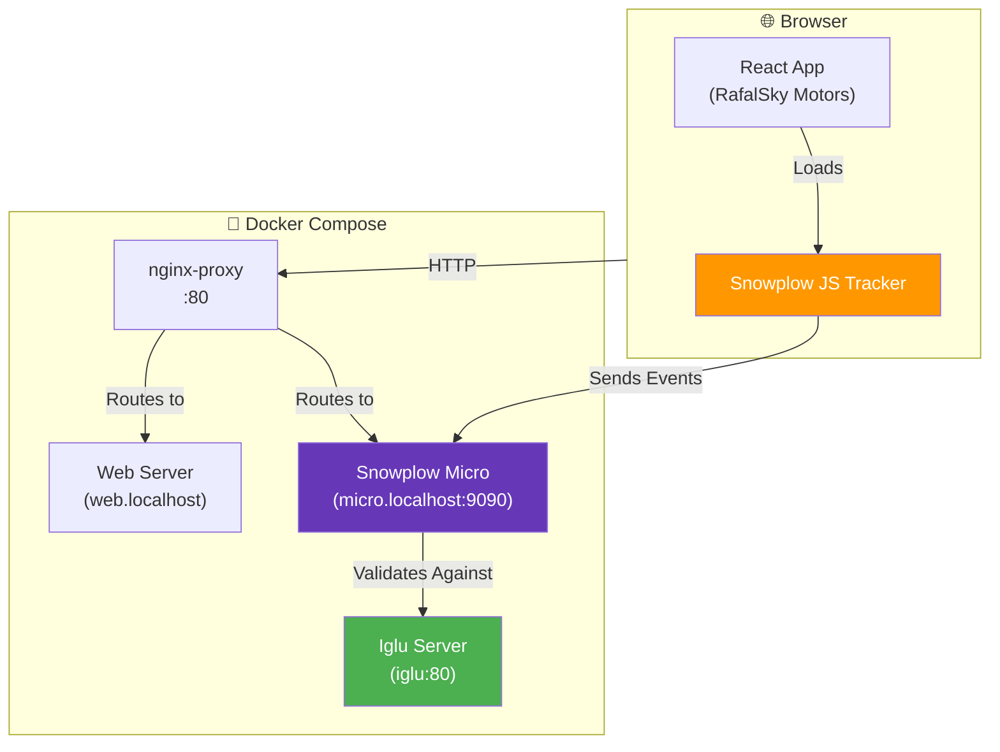

# Snowplow Micro E2E Pipeline - Proof of Concept

[](https://opensource.org/licenses/MIT)
[](https://www.docker.com/)
[](https://github.com/snowplow-incubator/snowplow-micro)

> **Browser-side event tracking and validation using Snowplow Micro, custom Iglu schemas, and a real-world automotive dealer demo application.**

## 📋 Table of Contents

- [Overview](#overview)
- [Key Features](#key-features)
- [Architecture](#architecture)
- [Project Structure](#project-structure)
- [Custom Event Schemas](#custom-event-schemas)
- [Getting Started](#getting-started)
- [Usage](#usage)
- [Development Roadmap](#development-roadmap)
- [License](#license)

---

## 🎯 Overview

This project demonstrates a **complete browser-side analytics pipeline** using **Snowplow Micro** for event collection and validation. It serves as a proof of concept for implementing sophisticated event tracking in a real-world scenario—an automotive dealership website.

The solution integrates:
- **Snowplow JavaScript Tracker** for browser-side event capture
- **Snowplow Micro** for lightweight event collection and validation
- **Custom Iglu schema registry** for domain-specific event definitions
- **RafalSky Motors** demo application—a React-based car dealership site

This POC validates the approach before scaling to production Snowplow infrastructure.

---

## ✨ Key Features

### 🔍 **Real-time Event Tracking**
- Automatic page view tracking for single-page applications (SPA)
- Activity tracking with configurable heartbeat intervals
- Custom event tracking for automotive-specific user actions

### 🏗️ **Custom Schema Registry**
- Self-hosted Iglu server with domain-specific schemas
- Vendor prefix: `com.dealer`
- Pre-defined schemas for:
  - Car detail views
  - Lead submissions
  - Purchase intent signals
  - Listing page views
  - Generic page views

### 🐳 **Containerized Architecture**
- Fully Dockerized setup with Docker Compose
- Nginx reverse proxy for service routing
- Isolated services for web, Iglu, and Snowplow Micro
- Local development-friendly with `.localhost` domains

### 📊 **Event Validation**
- Real-time schema validation via Snowplow Micro
- Event inspection at `http://localhost:9090/micro/all`
- Good/bad event separation for quality assurance

---

## 🏛️ Architecture



### **Component Breakdown**

| Component | Technology | Purpose | Endpoint |
|-----------|-----------|---------|----------|
| **nginx-proxy** | `nginxproxy/nginx-proxy:alpine` | Routes requests to appropriate services | `http://localhost` |
| **Web Server** | `nginx:alpine` | Serves the React SPA | `http://web.localhost` |
| **Iglu Server** | `nginx:alpine` | Hosts custom JSON schemas | `http://iglu:80` (internal) |
| **Snowplow Micro** | `snowplow/snowplow-micro` | Collects and validates events | `http://micro.localhost:9090` |

---

## 📂 Project Structure

```
snowplow-micro-e2e-pipeline-poc/
├── config/
│   └── nginx.conf                    # Nginx configuration for web/Iglu servers
├── iglu/
│   └── com.dealer/                   # Custom schema vendor namespace
│       ├── car_detail_view/          # Car detail page view schema
│       ├── lead_submitted/           # Lead form submission schema
│       ├── listing_view/             # Car listing view schema
│       ├── page_view/                # Generic page view schema
│       └── purchase_intent/          # Purchase intent signal schema
├── micro-config/
│   └── iglu-resolver.json            # Iglu resolver configuration for Micro
├── web/
│   ├── index.html                    # Main HTML with Snowplow tracker
│   ├── track.js                      # Snowplow tracker initialization
│   ├── sp.js                         # Snowplow JavaScript tracker library
│   └── assets/                       # React app build artifacts
├── docker-compose.yml                # Docker services orchestration
├── run.sh                            # Quick start script (upcoming)
└── README.md                         # This file
```

### **Key Directories**

- **`iglu/`** — Custom event schemas in Iglu's static registry format (`vendor/event_name/jsonschema/version/schema.json`)
- **`micro-config/`** — Configuration files for Snowplow Micro (Iglu resolver)
- **`web/`** — Production build of [RafalSky Motors](https://github.com/Rafalsky/rafalsky-motors) React application
- **`config/`** — Nginx configuration shared by web and Iglu servers

---

## 📝 Custom Event Schemas

This POC includes **5 custom event schemas** tailored for automotive dealer analytics:

### 🚗 **1. Car Detail View** (`com.dealer/car_detail_view`)
Tracks when a user views detailed information about a specific vehicle.

**Key Properties:**
- `carId`, `make`, `model`, `price`, `mileage`, `year`, `vin`

**Use Case:** Understand which vehicles attract the most interest.

---

### 📧 **2. Lead Submitted** (`com.dealer/lead_submitted`)
Captures contact form submissions from potential buyers.

**Key Properties:**
- `fullName`, `email`, `phone`, `preferredCar`, `message`

**Use Case:** Track lead generation and conversion funnel effectiveness.

---

### 💰 **3. Purchase Intent** (`com.dealer/purchase_intent`)
Signals when a user clicks "Buy This Car" or "Reserve."

**Key Properties:**
- `carId`, `make`, `model`, `price`, `intentType` (`buy-now` | `reserve`), `source`, `url`

**Use Case:** Identify high-intent users for sales prioritization.

---

### 📋 **4. Listing View** (`com.dealer/listing_view`)
Tracks views of the car inventory listing page.

**Use Case:** Analyze search patterns and filter usage.

---

### 📄 **5. Page View** (`com.dealer/page_view`)
Generic page view events for non-automotive pages.

**Use Case:** General site navigation analytics.

---

## 🚀 Getting Started

### **Prerequisites**

- [Docker](https://www.docker.com/get-started) (v20.10+)
- [Docker Compose](https://docs.docker.com/compose/install/) (v2.0+)
- `/etc/hosts` entries for local development:
  ```bash
  127.0.0.1 web.localhost
  127.0.0.1 micro.localhost
  ```

### **Installation**

1. **Clone the repository:**
   ```bash
   git clone https://github.com/Rafalsky/snowplow-micro-e2e-pipeline-poc.git
   cd snowplow-micro-e2e-pipeline-poc
   ```

2. **Start the services:**
   ```bash
   # Using the quick start script (recommended)
   ./run.sh
   
   # Or manually with Docker Compose
   docker-compose up -d
   ```

3. **Verify services are running:**
   ```bash
   docker-compose ps
   ```
   
   You should see 4 containers: `nginx-proxy`, `web`, `iglu`, and `micro`.

---

## 🎮 Usage

### **1. Access the Demo Application**

Open your browser and navigate to:
```
http://web.localhost
```

You'll see the **RafalSky Motors** automotive dealership site. Browse vehicles, view details, and submit contact forms—all actions are tracked!

### **2. View Tracked Events**

Snowplow Micro provides a REST API to inspect collected events:

```bash
# View all events
curl http://localhost:9090/micro/all | jq

# View only good (valid) events
curl http://localhost:9090/micro/good | jq

# View only bad (invalid) events
curl http://localhost:9090/micro/bad | jq

# Reset event store
curl -X POST http://localhost:9090/micro/reset
```

**Web Interface:**
- All events: [http://localhost:9090/micro/all](http://localhost:9090/micro/all)
- Good events: [http://localhost:9090/micro/good](http://localhost:9090/micro/good)
- Bad events: [http://localhost:9090/micro/bad](http://localhost:9090/micro/bad)

### **3. Understand Tracked Events**

The demo application automatically tracks:

- ✅ **Page views** — Every route change in the React SPA
- ✅ **Activity tracking** — User engagement heartbeats
- ✅ **Custom events** — Structured events for demo purposes

**Example Event Flow:**
1. User navigates to `http://web.localhost`
2. Snowplow tracker sends `page_view` event to Micro
3. Micro validates against Iglu schemas
4. Event appears in `/micro/good` if valid, `/micro/bad` if invalid

---

## 🗺️ Development Roadmap

This POC is the foundation for a comprehensive Snowplow analytics ecosystem. The following enhancements are planned:

### **Phase 1: Server-Side Tagging** 🔄
- [ ] Implement server-side tracking proof of concept
- [ ] Compare browser-side vs. server-side data accuracy
- [ ] Evaluate latency and performance characteristics
- [ ] Document migration patterns from client to server tracking

### **Phase 2: Full Snowplow Infrastructure** 🏗️
- [ ] Replace Snowplow Micro with production-grade components:
  - Snowplow Collector
  - Snowplow Enrich
  - Stream processing (Kinesis/Pub/Sub/Kafka)
  - Data warehouse loader (Redshift/BigQuery/Snowflake)
- [ ] Implement real-time event processing pipeline
- [ ] Set up data modeling with dbt

### **Phase 3: E2E BDD Testing** 🧪
- [ ] Create Cucumber/Gherkin BDD test scenarios
- [ ] Implement automated E2E tests using Snowplow Micro
- [ ] Validate event schemas and data quality in CI/CD
- [ ] Build regression test suite for tracking implementations

### **Phase 4: Enhanced Custom Events & Contexts** 🎯
- [ ] Add new custom event schemas:
  - `button_click` — Generic button interaction tracking
  - `vehicle_buy` — Complete purchase transaction event
  - `form_sent` — Generic form submission tracking
- [ ] Add custom contexts:
  - User context (authentication state, preferences)
  - Vehicle context (inventory metadata)
  - Session context (visit information)
- [ ] Integrate custom schemas with Iglu Server
- [ ] Update demo application to trigger new events
- [ ] Create schema evolution strategy (versioning, migration)

### **Phase 5: Advanced Analytics** 📊
- [ ] Attribution modeling
- [ ] Funnel analysis dashboards
- [ ] Real-time alerts for high-value events
- [ ] ML-based lead scoring

---

## 📜 License

This project is licensed under the **MIT License** — see the [LICENSE](LICENSE) file for details.

---

## 🙏 Acknowledgments

- **[Snowplow Analytics](https://snowplowanalytics.com/)** — For the open-source analytics platform
- **[Snowplow Micro](https://github.com/snowplow-incubator/snowplow-micro)** — Lightweight testing tool
- **[RafalSky Motors](https://github.com/Rafalsky/rafalsky-motors)** — Demo application frontend

---

## 📧 Contact

**Rafał Międziocha**  
For questions, suggestions, or collaboration opportunities, feel free to open an issue in this repository.

---

**Built with ❤️ for better analytics engineering**